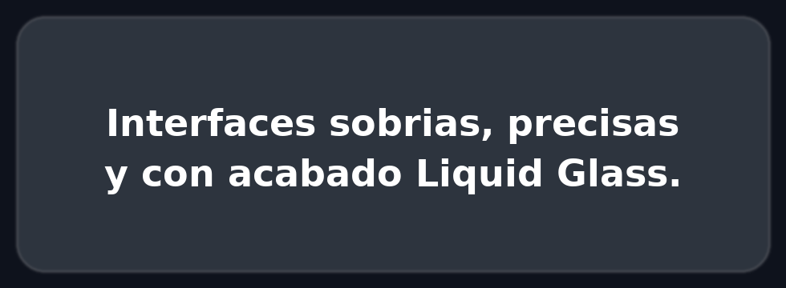
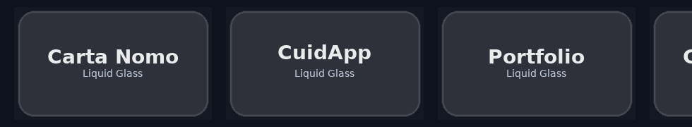
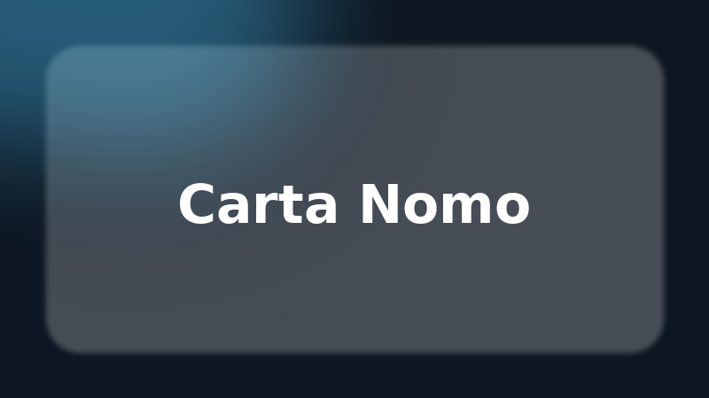
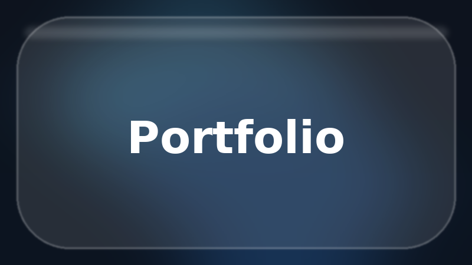
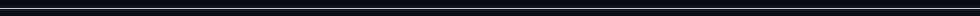

<!-- HERO -->

  

<h1 align="center">Aldair Zapata</h1>

  Ingeniero Informático · UX/UI · Full-Stack · <b>Liquid Glass Aesthetics</b> 
  Firebase · SwiftUI · Web & Mobile

  
  
  
  

---

## ✨ Sobre mí
- Diseño y desarrollo productos con estética **Liquid Glass** (sobrio, premium y accesible).
- Stack: **HTML/CSS/JS**, **Firebase (Auth, Firestore, Storage, FCM)** y **SwiftUI**.

---

## 🚀 Proyectos Destacados

<!-- Tira animada para dar vida a la sección -->

  

<!-- Grid de 3 columnas (tabla HTML para mayor control en GitHub) -->
<table>
  <tr>
    <td width="33%">
      <h3 align="center">📖 Carta Nomo</h3>
      
      

        App interactiva para aprender números (1–100). 
        <b>Firebase</b> · HTML · CSS · JavaScript 
        
        
      

    </td>
    <td width="33%">
      <h3 align="center">🧑‍⚕️ CuidApp</h3>
      
      

        Conecta familias y cuidadores con chat y pagos. 
        <b>SwiftUI</b> · Firebase · Stripe 
        
        
      

    </td>
    <td width="33%">
      <h3 align="center">🌐 Portfolio</h3>
      
      

        Mi sitio web personal con diseño glassmorphism. 
        HTML · CSS · JavaScript 
        
        
      

    </td>
  </tr>
</table>

---

## 🛠️ Tech Stack

  
  
  
  
  
  
  

---

## 📊 GitHub Stats

  
  

---

## 📬 Contacto
📍 Barcelona, España  
✉️ [alzpta@gmail.com](mailto:alzpta@gmail.com)  
🌐 [Portfolio](https://alzpta.github.io/)

---

   
 

