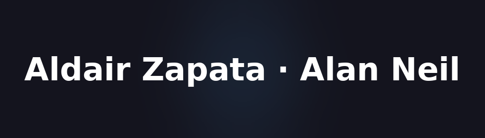
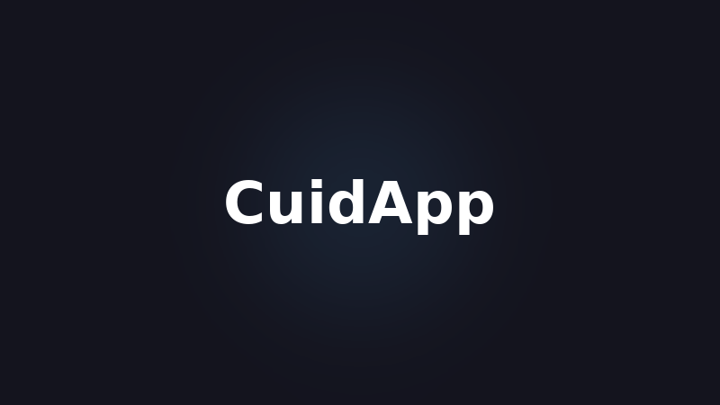

<!-- Hero -->

  

<h1 align="center">Hola, soy Aldair Zapata (aka Alan Neil) 👋</h1>

  Ingeniero Informático · UX/UI + Full-Stack · Firebase · SwiftUI · <b>Liquid Glass Aesthetics</b>

  
  
  
  

---

### ✨ Sobre mí
- Diseño y desarrollo productos con estética **Liquid Glass** y enfoque **accesible** y **rápido**.  
- Construyo en **HTML/CSS/JS**, **Firebase (Auth/Firestore/Storage/FCM)** y **SwiftUI**.  
- También hago música como **Alan Neil** (narrativa + sonido + visual).

---

### 🛠️ Tech Stack

  &nbsp;
  &nbsp;
  &nbsp;
  &nbsp;
  &nbsp;
  &nbsp;
  

---

### 🚀 Proyectos Destacados

<!-- Grid de proyectos -->
<table>
  <tr>
    <td width="33%">
      <h3>📖 Carta Nomo</h3>
      
      
App interactiva para visualizar, editar y escuchar palabras (1–100). 
      <b>Firebase</b> · HTML · CSS · JavaScript

      <a href="https://alzpta.github.io/Carta-Nomo/">▶ Demo</a> ·
      <a href="https://github.com/alzpta/Carta-Nomo">Código</a>
    </td>
    <td width="33%">
      <h3>🧑‍⚕️ CuidApp</h3>
      
      
Conecta familias y cuidadores. Verificación, chat, pagos. 
      <b>SwiftUI</b> · Firebase · Stripe

      <a href="https://alzpta.github.io/CuidApp/">▶ Ver más</a> ·
      <a href="https://github.com/alzpta/CuidApp">Código</a>
    </td>
    <td width="33%">
      <h3>🌐 Portfolio Liquid Glass</h3>
      
      
Web personal con glassmorphism sobrio y rendimiento alto. 
      HTML · CSS · JS

      <a href="https://alzpta.github.io/">▶ Visitar</a> ·
      <a href="https://github.com/alzpta/alzpta.github.io">Código</a>
    </td>
  </tr>
</table>

---

### 📈 Métricas

  
  

---

### 🎵 Alan Neil

  
  
  

---

### 📬 Contacto
- 📍 Barcelona, España  
- ✉️ <a href="mailto:alzpta@gmail.com">alzpta@gmail.com</a>  
- 🌐 <a href="https://alzpta.github.io/">Portfolio</a>
