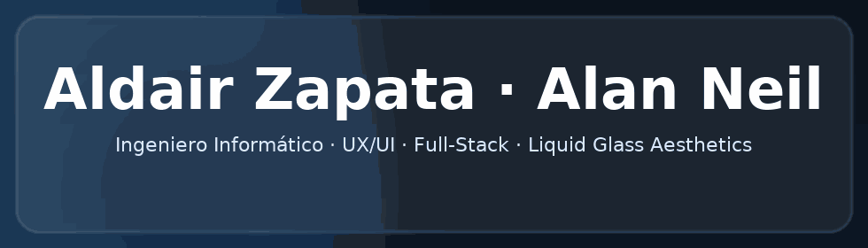
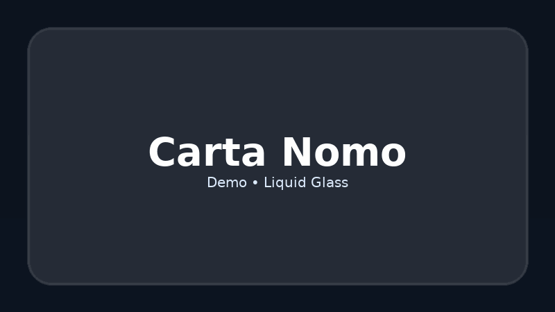
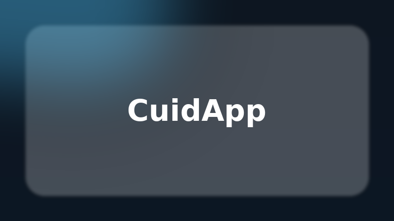
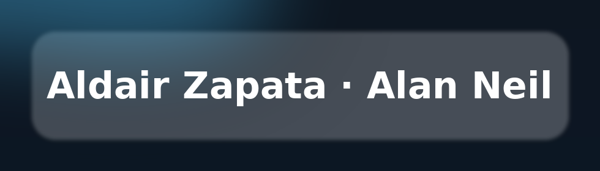

<!-- Banner Animado -->

  

<h1 align="center">Aldair Zapata</h1>

  Ingeniero Informático · UX/UI · Full-Stack · <b>Liquid Glass Aesthetics</b> 
  Firebase · SwiftUI · Web & Mobile

  
  
  
  

---

## ✨ Sobre mí
- Diseño y desarrollo productos con estética **Liquid Glass** (sobrio, premium, accesible y rápido).  
- Stack: **HTML/CSS/JS**, **Firebase (Auth, Firestore, Storage, FCM)** y **SwiftUI**.  
- También creo música como **Alan Neil** (narrativa + sonido + visual).

---

## 🚀 Proyectos Destacados

<table>
  <tr>
    <td width="33%">
      <h3 align="center">📖 Carta Nomo</h3>
      
      

        App interactiva para visualizar, editar y escuchar palabras (1–100). 
        <b>Firebase</b> · HTML · CSS · JavaScript 
        <a href="https://alzpta.github.io/Carta-Nomo/">Demo</a> · 
        <a href="https://github.com/alzpta/Carta-Nomo">Código</a>
      

    </td>
    <td width="33%">
      <h3 align="center">🧑‍⚕️ CuidApp</h3>
      
      

        Conecta familias y cuidadores. Verificación, chat, pagos. 
        <b>SwiftUI</b> · Firebase · Stripe 
        <a href="https://alzpta.github.io/CuidApp/">Ver más</a> · 
        <a href="https://github.com/alzpta/CuidApp">Código</a>
      

    </td>
    <td width="33%">
      <h3 align="center">🌐 Portfolio Liquid Glass</h3>
      
      

        Web personal con glassmorphism sobrio y rendimiento alto. 
        HTML · CSS · JavaScript 
        <a href="https://alzpta.github.io/">Visitar</a> · 
        <a href="https://github.com/alzpta/alzpta.github.io">Código</a>
      

    </td>
  </tr>
</table>

---

## 🛠️ Tech Stack

  &nbsp;
  &nbsp;
  &nbsp;
  &nbsp;
  &nbsp;
  &nbsp;
  

---

## 📊 Stats

  
  

---

## 📬 Contacto
- 📍 Barcelona, España  
- ✉️ [alzpta@gmail.com](mailto:alzpta@gmail.com)  
- 🌐 [Portfolio](https://alzpta.github.io/)
