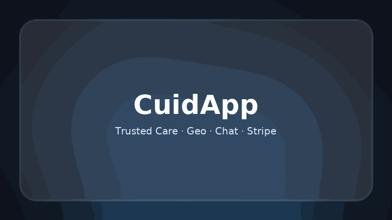
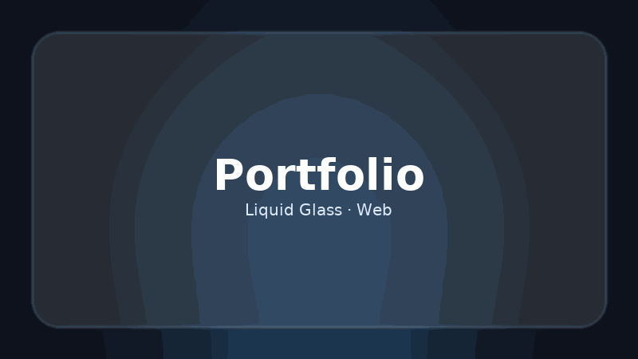

<!-- Hero -->

 

<h1 align="center">👋 Hola, soy Aldair Zapata (Alan Neil)</h1>

  Ingeniero Informático · UX/UI · Full-Stack 
  <b>Liquid Glass Aesthetics</b> · Firebase · SwiftUI · Web & Mobile

  
  
  
  

---

## ✨ Sobre mí
- Desarrollo productos digitales con estética **Liquid Glass**, sobrios y accesibles.  
- Mi stack combina **Firebase**, **SwiftUI** y **tecnologías web modernas**.  
- Como **Alan Neil**, creo música donde se cruzan narrativa, sonido y visual.  

---

## 🚀 Proyectos Destacados

<!-- Marquesina animada -->

  

<!-- Grid con tarjetas animadas -->
<table>
  <tr>
    <td width="33%">
      <h3 align="center">📖 Carta Nomo</h3>
      
      

        App interactiva para aprender números (1–100). 
        <b>Firebase</b> · HTML · CSS · JavaScript
      

      

        <a href="https://alzpta.github.io/Carta-Nomo/">🔗 Demo</a> · 
        <a href="https://github.com/alzpta/Carta-Nomo">💻 Código</a>
      

    </td>

    <td width="33%">
      <h3 align="center">🧑‍⚕️ CuidApp</h3>
      
      

        Conecta familias y cuidadores con chat y pagos. 
        <b>SwiftUI</b> · Firebase · Stripe
      

      

        <a href="https://alzpta.github.io/CuidApp/">🔗 Ver más</a> · 
        <a href="https://github.com/alzpta/CuidApp">💻 Código</a>
      

    </td>

    <td width="33%">
      <h3 align="center">🌐 Portfolio</h3>
      
      

        Mi sitio web personal con diseño glassmorphism. 
        HTML · CSS · JavaScript
      

      

        <a href="https://alzpta.github.io/">🔗 Visitar</a> · 
        <a href="https://github.com/alzpta/alzpta.github.io">💻 Código</a>
      

    </td>
  </tr>
</table>

---

## 🛠️ Tech Stack

  
  
  
  
  
  
  

---

## 📊 GitHub Stats

  
  

---

## 🎵 Alan Neil

  
  
  

---

## 📬 Contacto
📍 Barcelona, España  
✉️ [alzpta@gmail.com](mailto:alzpta@gmail.com)  
🌐 [Portfolio](https://alzpta.github.io/)
